Some Possible Modeling Aproaches for Ibis ROI
================
Michael Arciero
3/9/2022

-   [Overview](#overview)
-   [Modeling approaches](#modeling-approaches)
-   [Examples with real and fake
    data](#examples-with-real-and-fake-data)
-   [Modeling HCC counts](#modeling-hcc-counts)
-   [Modeling `visits`.](#modeling-visits)
-   [More fake data](#more-fake-data)
-   [Stratification and contrasts](#stratification-and-contrasts)
-   [Things we’ve left out](#things-weve-left-out)

## Overview

We combine real and simulated data for illustration of a modeling
framework for  
the number of hospital and ER visits for patients, and subsequently cost
and other statistics of interest, for users of Senscio Systems Ibis
tablet device for self care management. We use data such as

-   demographic - age, gender, geographic (city, town, zip code)
-   socioeconomic- income or financial class strata,
-   health data - ICD 10 and procedure codes, medications, etc.

With many thousands of predictor variables, we can perform feature
engineering and selection to reduce the size of the predictor set. Such
techniques include

-   regularization
-   likelihood encoding
-   principle component analysis

## Modeling approaches

We propose to model `visits` as a function of the other predictors using
Poisson or Negative Binomial regression, which are both appropriate for
count data. The latter is often used with over or under dispersed data
because there is an additional shape parameter to model.

We primarily use a Bayesian approach where possible.

-   models likelihood of parameters given the data (which we know),
    rather the other way around as with null-hypotheis-significane-test
    (NHST) type approaches
-   distributions rather than point estimates, for all parameters, not
    just outcome variable
-   ability to model any function of parameters or outcome variables,
    such as cost for given number of visits.
-   ability to easily examine changes in outcome with change in a single
    predictor; eg how the *distribution* of
    `visits` varies between users and non users of Ibis for patients of
    a given gender, financial class, medical profile, etc.
-   computationally expensive

### Condition categories

We can use condition categories such as the CMS HCC (hierarchical
condition categories) to map ICD 10 codes to a reduced set of
predictors. HCC are based on clinical relationships of diagnoses, and
are used to perform risk adjustment for Medicare Advantage plans.
Potential abuses from “gaming” the coding are not an issue if we do the
mapping ourselves, assuming “honest” ICD 10 diagnoses. Gaming is less an
issue also because the HCCs will be predictors in a model, and not used
to generate a cost directly.

CMS has tables defining the ICD 10 → HCC assignments and I’ve done a
partial mapping manually on a sample data set. We may also be able to
obtain data from Chronic Conditions Warehouse, an entity contracted by
CMS for the purpose of curating Medicare patient data for researchers.
They can provide software which outputs and single risk score for a
given patient. In fact, the CMS risk score actually a form of
*likelihood encoding* of categorical variables.

## Examples with real and fake data

Our sample data consists of 4539 individual patients with a row for each
visit containing IDC 10 codes.

    # A tibble: 6 × 33
      `PATIENT NBR` `FIN CLASS`   DRG `DIAG 1` `DIAG 2` `DIAG 3` `DIAG 4` `DIAG 5`
      <chr>         <chr>       <dbl> <chr>    <chr>    <chr>    <chr>    <chr>   
    1 000000001     C              NA J44.9    J30.9    I50.32   G62.9    K21.9   
    2 000000001     C              NA J43.9    J47.9    G47.33   K21.9    I50.32  
    3 000000002     CP             NA F33.1    I11.0    I50.22   D64.9    R11.0   
    4 000000002     CP             NA F33.2    I11.0    I50.22   H91.90   F43.22  
    5 000000002     CP             NA I26.99   D64.9    E86.0    F32.9    F43.22  
    6 000000002     CP             NA Z04.3    M25.572  R29.6    R26.81   I11.0   
    # … with 25 more variables: `DIAG 6` <chr>, `DIAG 7` <chr>, `DIAG 8` <chr>,
    #   `DIAG 9` <chr>, `DIAG 10` <chr>, `DIAG 11` <chr>, `DIAG 12` <chr>,
    #   `DIAG 13` <chr>, `DIAG 14` <chr>, `DIAG 15` <chr>, `CPT 1` <chr>,
    #   `CPT 2` <dbl>, `CPT 3` <dbl>, `CPT 4` <chr>, `CPT 5` <dbl>, `CPT 6` <dbl>,
    #   `CPT 7` <dbl>, `CPT 8` <dbl>, `CPT 9` <dbl>, `CPT 10` <lgl>,
    #   `CPT 11` <lgl>, `CPT 12` <lgl>, `CPT 13` <lgl>, `CPT 14` <lgl>,
    #   `CPT 15` <lgl>

Table of ICD 10 to HCC mappings from CMS; approx 10,000 codes. A random
selection.

    # A tibble: 10 × 3
       Code    Description                                                     HCC  
       <fct>   <chr>                                                           <fct>
     1 T83090A Other mechanical complication of cystostomy catheter, initial … 176  
     2 S32474B Nondisplaced fracture of medial wall of right acetabulum, init… 170  
     3 T65222S Toxic effect of tobacco cigarettes, intentional self-harm, seq… 59   
     4 E093551 Drug or chemical induced diabetes mellitus with stable prolife… 18   
     5 T480X2A Poisoning by oxytocic drugs, intentional self-harm, initial en… 59   
     6 M05022  Felty's syndrome, left elbow                                    40   
     7 I69149  Monoplegia of lower limb following nontraumatic intracerebral … 104  
     8 S98311D Complete traumatic amputation of right midfoot, subsequent enc… 189  
     9 D47Z9   Other specified neoplasms of uncertain behavior of lymphoid, h… 48   
    10 C212    Malignant neoplasm of cloacogenic zone                          11   

-   Map each patient’s diagnosis codes to HCCs.
-   Compute and create columns for the number of unique HCC codes and
    the number of visits.
-   Add fake `gender`, `age`, and `financial` predictor data. The `age`
    was simulated such that older patients had higher probability of
    higher hcc counts.

<!-- -->

    # A tibble: 6 × 8
      PATIENT_NBR            data HCC_unique visits hcc_conds   age gender financial
      <chr>       <list<tibble[,> <list>      <int>     <int> <dbl> <fct>  <ord>    
    1 000000001          [29 × 6] <fct [4]>       2         3    68 M      3        
    2 000000002         [220 × 6] <fct [12]>     18        11    85 F      3        
    3 000000003          [21 × 6] <fct [2]>       2         1    74 M      3        
    4 000000004          [15 × 6] <fct [1]>       2         0    65 M      1        
    5 000000005          [14 × 6] <fct [3]>       2         2    69 M      1        
    6 000000006          [19 × 6] <fct [4]>       2         3    79 M      1        

The unique codes are nested in the corresponding column above. If we
expand, we see that Patient 001 has three HCC codes: 111, 185, and 112.

    # A tibble: 6 × 8
      PATIENT_NBR            data HCC_unique visits hcc_conds   age gender financial
      <chr>       <list<tibble[,> <fct>       <int>     <int> <dbl> <fct>  <ord>    
    1 000000001          [29 × 6] 111             2         3    68 M      3        
    2 000000001          [29 × 6] <NA>            2         3    68 M      3        
    3 000000001          [29 × 6] 85              2         3    68 M      3        
    4 000000001          [29 × 6] 112             2         3    68 M      3        
    5 000000002         [220 × 6] 59             18        11    85 F      3        
    6 000000002         [220 × 6] 85             18        11    85 F      3        

This data set has 4539 individual patients. Plots of visits and HCC
distributions.

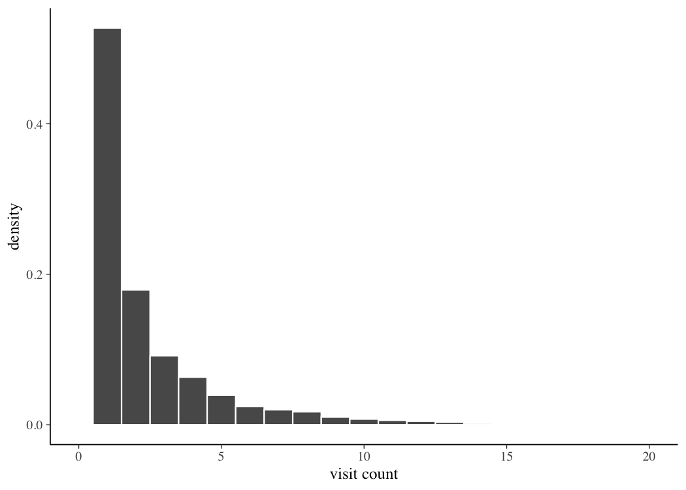

We can also take a look at the distribution of HCCs. There are 86 of
them here.

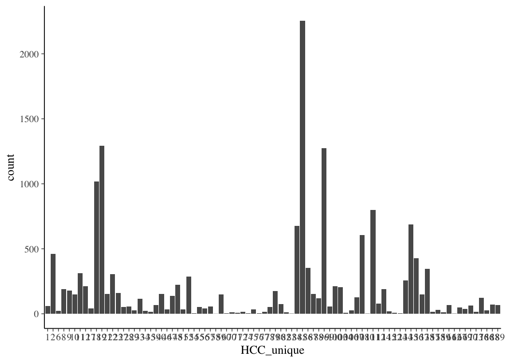
Difficult to see here but the most common is 85, which contains a range
of ICD 10 codes beginning with A and I, under the general category of
congestive heart failure. HCC 19, “diabetes without complication” and
96, “heart arhythmias”, are also common.

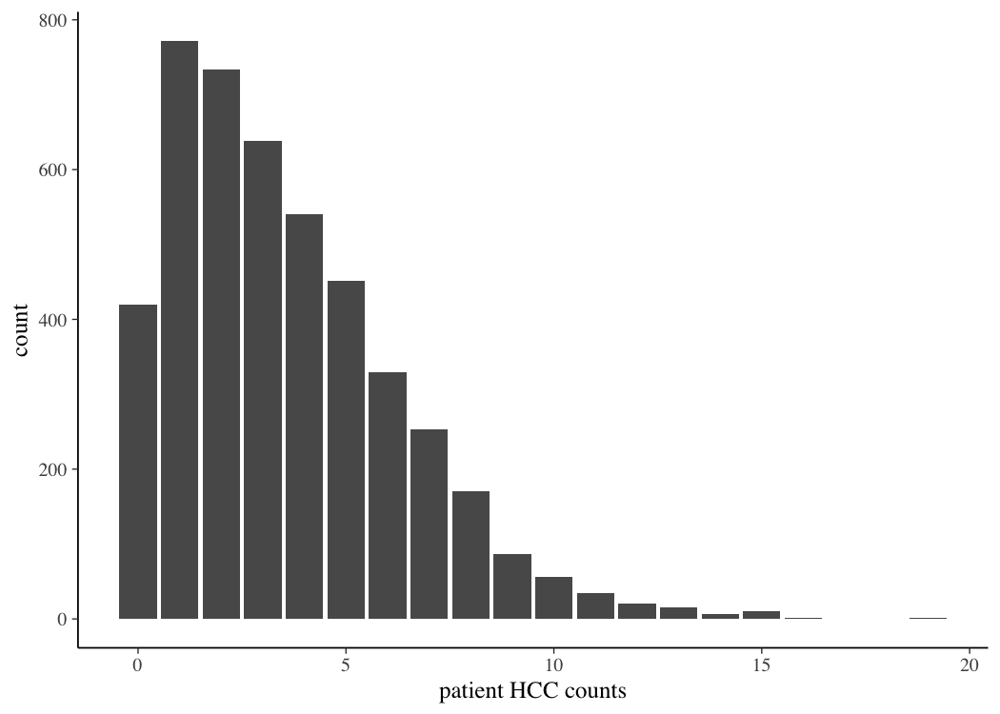

## Modeling HCC counts

Before we look at `visit` data, to illustrate the modeling approach we
model the number of patient HCCs, `hcc_conds`, using using a Poisson
regression, which are often used to model count data. The Poisson
distribution is characterized by a single parameter, the mean, *μ*,
which is simply the average (i.e. the mean) number of hcc counts.
Poisson regression is an example of a *generalized linear model* (GLM).
In a GLM we use a *link* function to map the mean *μ* to a linear
function of the predictors. The main purpose of the link function is to
ensure that the values of *μ* fall within the permissible range of
values for the model. For the Poisson, *μ* is the mean count value, so
must be positive, and we typically use the logarithm. For example if we
used `age` and `gender` as predictors we would write

$$
 \log \mu_i = \alpha + \beta_1 \times {age}_i + \beta_2 \times {gender}_i 
$$

Where the index *i* represents the age and gender of the
$i^{th}$ patient in the data record. One typically codes
categorical variables with a small number of levels as a “dummy”
indicator variables.

The predicted mean number of visits for patient *i* would then be given
by the Posson probability mass/distribution:

$$
 p(x = k) = \frac{\mu_i^k e^{-\mu_i}}{k!}
$$

where

$$
 \mu_i = \exp(\alpha + \beta_1 \times {age}_i + \beta_2 \times {gender}_i)
$$

Note that the exponential function “undoes” the logarithm. There are
many ways to model a given process. For example we can define model
coefficients for each gender *j*.

$$
\begin{align*}
\log \mu_{i,j} & =  \alpha_{j} + \beta_{1,j} \times {age}_i \\
\log \mu_{i,j} & = \alpha_0 + \alpha_{j} + (\beta_{0} + \beta_{1,j}) \times {age}_i
\end{align*}
$$


These would appropriate if the amount of increase of `hcc_count` with
`age` appeared to depend on `gender`. The first model essentially models
the genders separately while the second gives each gender an adjustment
to the overall. The second model is an example of a hierarchical model.
These perform partial pooling, taking advantage of group structure but
also pool results between groups. The modeling process estimates the
coefficients *α*, *β*<sub>1</sub>, and *β*<sub>2</sub>.

### Bayesian modeling

Generally, given a vector *θ* of parameters, Bayesian modeling treats
each, and hence any function of them, as a random variable. Each
parameter is given a “prior” distribution which is informed by domain
expertise and any prior knowledge. Now given the data, *x*; for example
the hcc counts and genders- Bayes’ Theorem then gives a “posterior
distribution” for the parameters:

$$
 p(\theta | x) = \frac{p(\theta) p(x | \theta)}{\int p(\theta) p(x | \theta) \ d\theta}
$$

The *p*(⋅) are probability densities or mass functions for the
respective arguments, and the vertical bar indicates that the density is
conditional on the values to the right. The factor *p*(*x*\|*θ*) is the
joint probability for all the observations, which in our case resulting
from the Poisson distribution above, now with the dependence on *θ*-in
our case (*α*,*β*) - made explicit. The denominator is essentially a
normalization constant which results from integration over the
multidimensional parameter space, and it is conventional to write

$$p(θ|x) \propto p(θ)p(x|θ)$$

Priors on coefficients can be chosen to incorporate prior knowledge
about the process; for example, that the number of visits will increase
with age, or to decrease the likelihood of unreasonable estimates, such
as an outcome of 100,000 visits for a patient in one year. On the other
hand, “weakly informative” priors-those with relatively large variance-
are often used to allow for model flexibility. With large amounts of
data the choice of prior tends to makes less and less of a difference.
For our examples, in most cases we used normally distributed priors with
mean zero and standard deviation 1. Mean zero would reflect no prior
belief about the influence of the predictor, and, since these are on log
scale effects are multiplicative, and the standard deviation of 1 in
fact represents a weak prior, with two standard deviations representing
86% decrease to a 700% increase for a unit increase in the predictor.
For the “intercept” *α* we used normal with mean equal to the log of the
mean outcome in the data; for example log mean of the number of visits.
We also use a positive mean for the age coefficient, expecting the
number of visits to increase with age. We note that we used a zero-mean
prior on the coefficient for the Ibis use in a later example. Much can
be said about choice of priors, again-domain expertise, informed by the
data, will come into play.

### Computational considerations

In practice, the evaluation of the posterior *p*(*θ*\|*x*) is only very
rarely tractable, so it is typically simulated via Markov Chain Monte
Carlo (MCMC) methods. Running the simulations can be computationally
intensive, and efficient methods for doing this and the computational
power have only recently become widely available. We use the Stan
programming language, which is a “probabilistic programming language”
developed for statistical modeling. Stan handles all the MCMC. We use R
language for general statistics and data science, and as an interface to
Stan. There is also a Python interface to Stan. Python also has its own
package for Bayesian modelling called PyMC3 which is popular and well
supported.

### Poisson model of `hcc_conds`

We will write

$$
 {hcc\_ conds}_i  \sim {Poisson}(\mu_i)
$$

to indicate that the number of hcc conditions `hcc_conds` is distributed
according to the Poisson distribution. We start with an “intercept only”
model; that is with *α* but no predictors; that is,

log *μ*<sub>*i*</sub> = *α*

All patients would have the same predicted mean visit. We obtain.

    # A tibble: 1 × 3
      term  estimate std.error
      <chr>    <dbl>     <dbl>
    1 alpha     1.27   0.00814

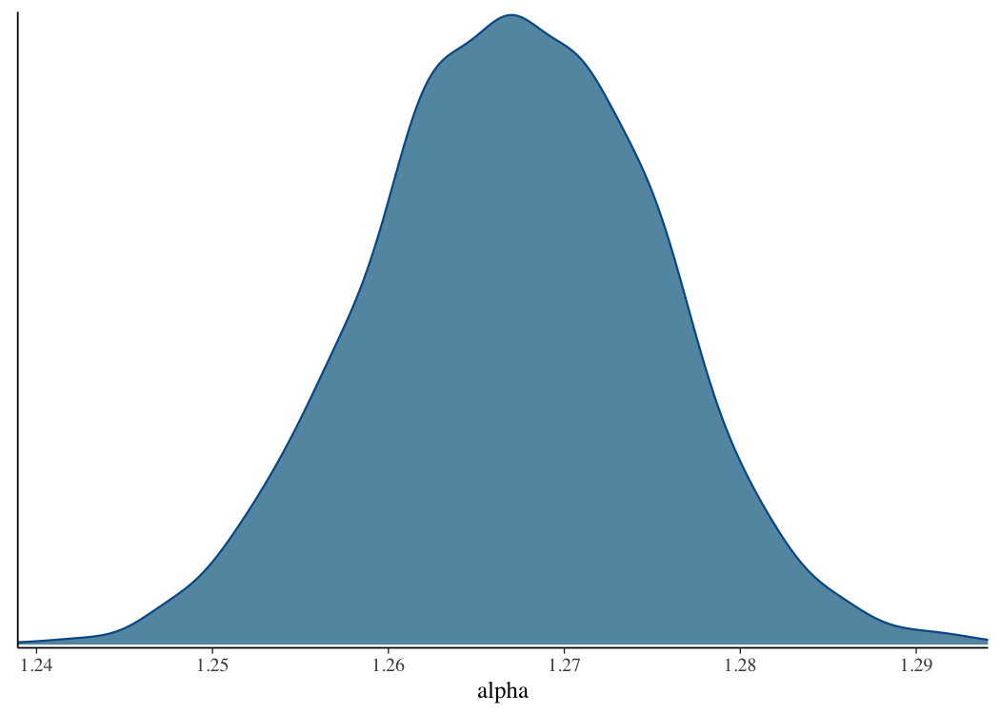

As promised, we get an entire distribution for *α*. We have also
generated posterior predictive samples of `hcc_conds` which we’ve
labelled `y_rep[]`. This is in contrast to frequentist methods, where
parameters like *α* are considered fixed but unkown, and point estimates
are generated, and confidence intervals centered at the point. The above
histogram is the result of 4000 samples from the simulated posterior
distribution *f*(*θ*\|*X*) in our expression above. There are also 4000
`y_rep[ ]` simulations for each of the 4688 observations. Note that this
is on the log scale, so to get the mean we find

``` r
exp(1.27)
```

    [1] 3.560853

Which agrees with the mean number of HCCs per patient for this data set,
which is about 3.5.

### Post predictive checks

One check we can do is to compare the distribution of `hcc_conds` from
the data with those from the posterior samples generated by the model.
Here, the former are labeled *y* and the latter,
*y*<sub>*r*</sub>*e**p*.
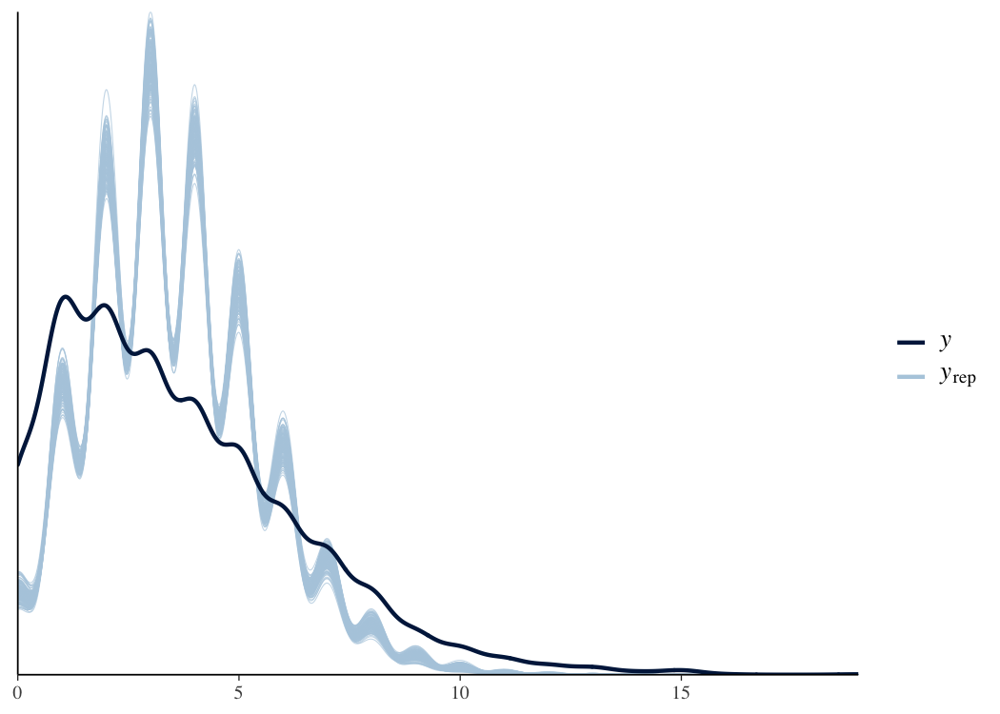

We can see that it is not too good. For one thing the model
underestimates the number of zeros, and overestimates 2 through 6, and
underestimates larger values. This so-called underdispersion is common
(as is overdispersion). Recall that Poisson is characterized by a single
parameter, which defines both its mean and standard deviation, so we
cant adjust that.

### Negative Binomial model

We can use the negative binomial distribution. We wont write down the
form of the negative binomial distribution as we did for Poisson (you
can look it up-it is a generalization of the binomial distribution) but
suffice to say that it is also used to model count data, and has two
parameters to play with, one that can adjust for the spread/variation of
the data, and also uses the log link function. So we will write

$$
   hcc _  conds_i \sim {NB}(\mu_i, \phi) \\
   \log \mu_i = \alpha
$$

We run the model and find

    # A tibble: 3 × 3
      term    estimate std.error
      <chr>      <dbl>     <dbl>
    1 alpha      1.27     0.0115
    2 inv_phi    0.324    0.0135
    3 phi        3.09     0.129 

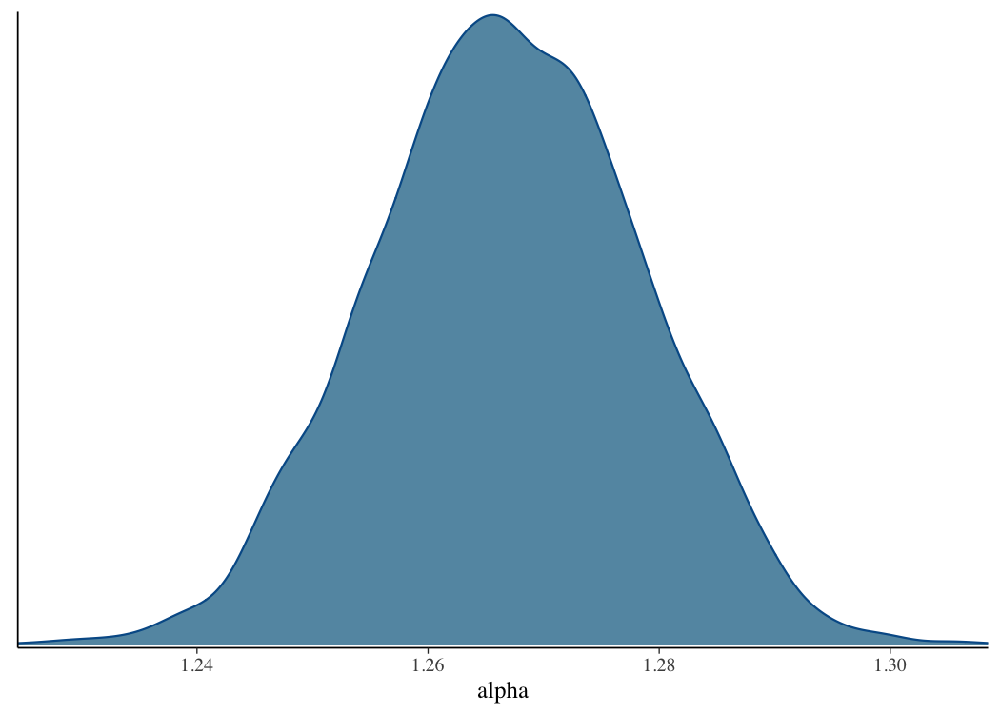
You can see the model estimates an additional shape parameter, *ϕ*,
which controls the standard deviation. (`inv_phi` = 1/*ϕ* was created
for convenience in the model, and was given a normal mean zero, variance
one prior.)

### Post predictive check

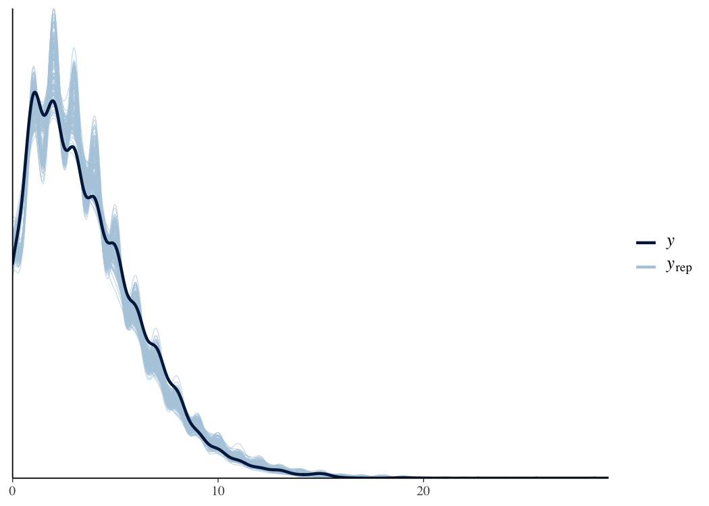
We can see the negative binomial does a much better job. As further
check we can how the distribution of proportions for different values of
hcc count compares with those in the data. For example about 9.3%
percent of the patients had zero `hcc_conds`. We can compare that to the
distribution of zeros in the posterior samples generated by the model.

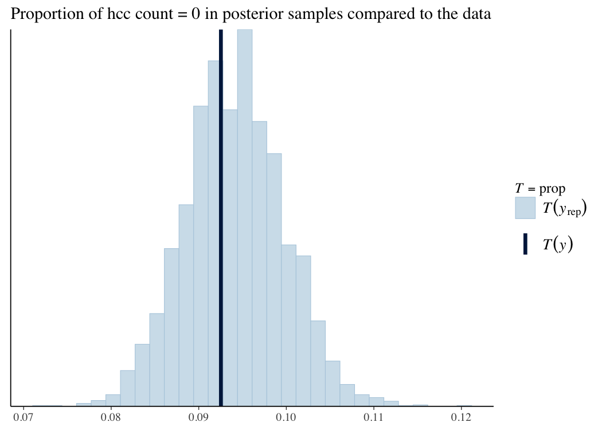
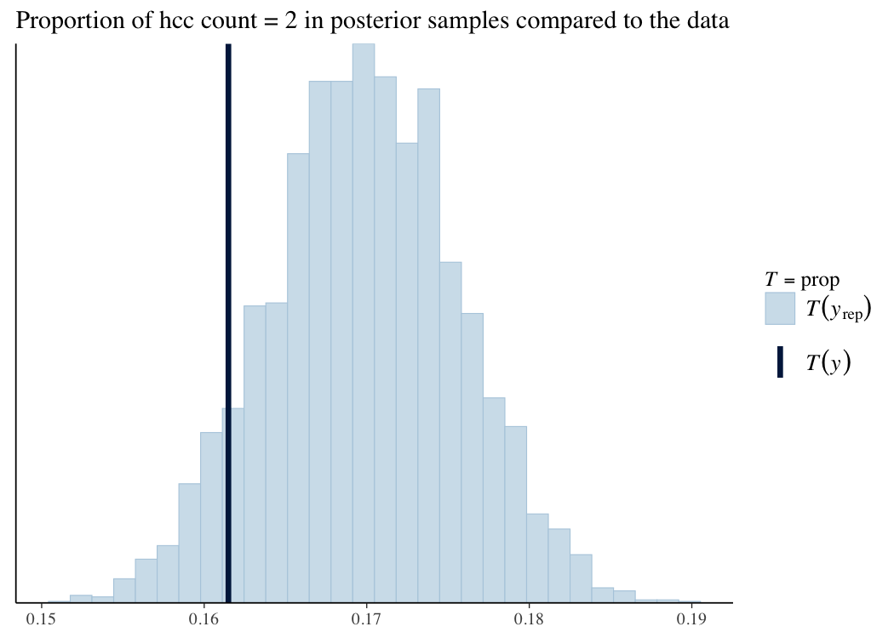

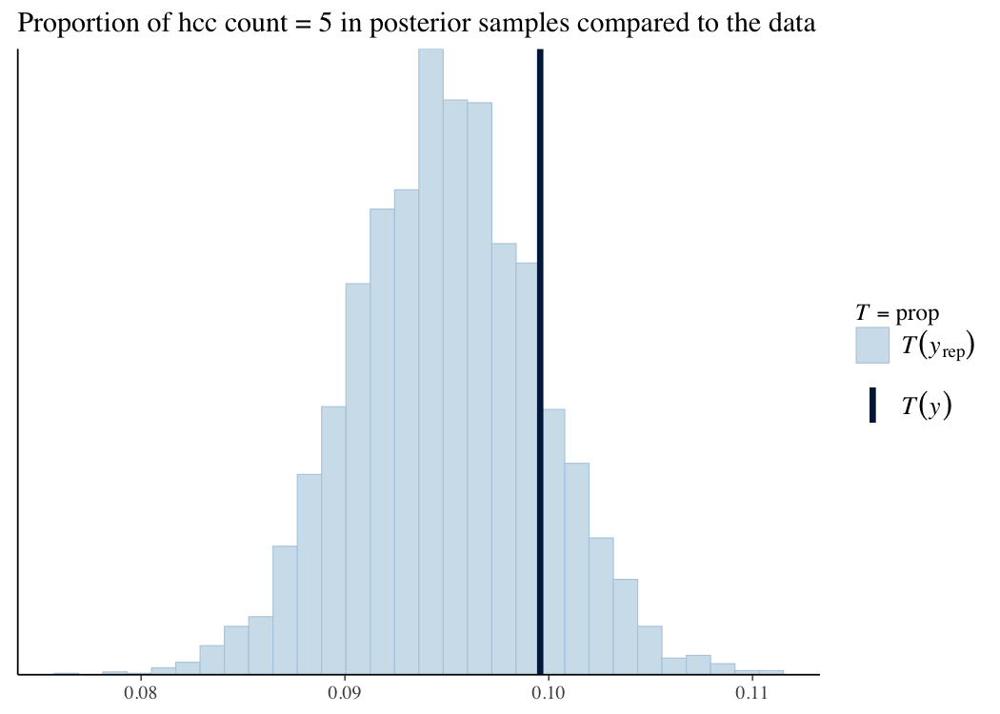

## Modeling `visits`.

Now we try modeling visits with various predictor variables. A real
model may have thousands of predictors, but we can illustrate the
approach with just one, the hcc counts we just considered. Then we will
add fake ibis use data to the model. The visit data is a bit different
than the hcc counts as there are no zeros present in the data set that I
have. Thus, both Poisson and negative binomial may be problematic. In
fact, with some care, truncated versions of these may be used. We do not
do this below, yet.

### Poisson model

Recall the distribution of visits

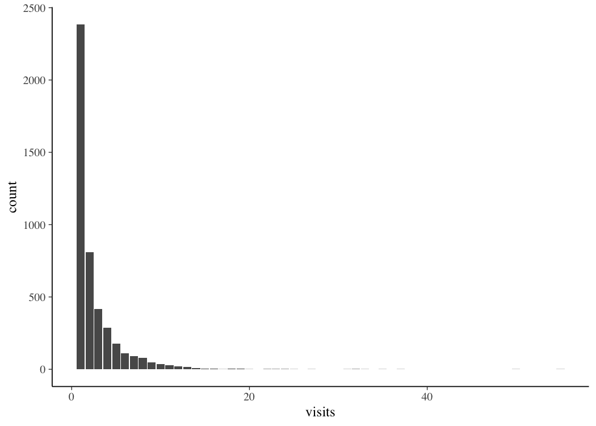

We try the Poisson regression with the single predictor `hcc_counts`. We
see there is a weak relationship

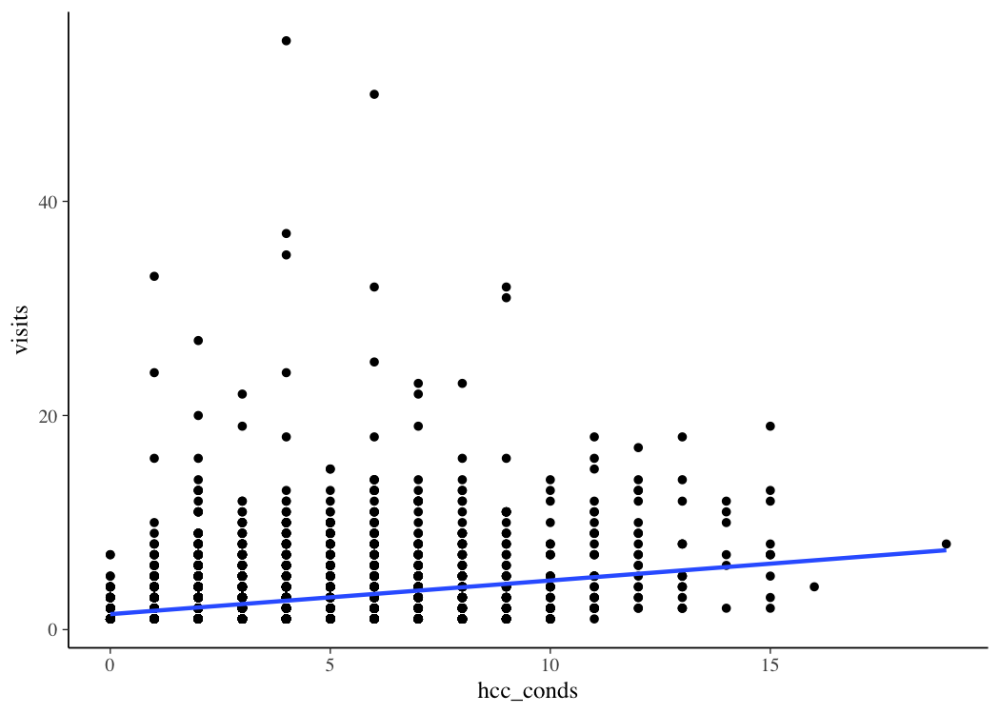
In fact, a non-Bayesian/NHST Poisson regression will conclude that the
relationship is “statistically significant”, as the p-value on the
coefficient is less than 0.05:

    # A tibble: 2 × 5
      term        estimate std.error statistic   p.value
      <chr>          <dbl>     <dbl>     <dbl>     <dbl>
    1 (Intercept)    0.520   0.0160       32.4 6.56e-231
    2 hcc_conds      0.105   0.00293      35.9 5.51e-283

Interpreting the coefficients is not as direct as it is with ordinary
linear regression models; that is, with identity link function. Its not
too bad here- the link is the log function so the effects are
multiplicative. Consider the mean for `hcc_conds`.

``` r
exp(0.100)
```

    [1] 1.105171

So with every increase in `hcc_conds`, we get a bit more than a 10% jump
in mean number of visits. Interpreting the coefficients is often not so
straightforward, depending on the model. Even here, we assume that we
are holding other predictors constant, which does not happen in real
life. Bayesian approaches skirt these issues entirely by simply
examining the posterior distribution at different levels of the
predictors. We will see how this is done.

The model is

$$
\begin{align*}
{visits}_i & \sim {Poisson}(\mu_{i}) \\
\log \mu_{i} & = \alpha +\beta \times hcc \  count_i \\
\end{align*}
$$

Here are the results.

    # A tibble: 2 × 3
      term  estimate std.error
      <chr>    <dbl>     <dbl>
    1 alpha    0.521   0.0151 
    2 beta     0.105   0.00282

Remembering that these values are on the log scale, we see that these
result are consistent with the non-bayes. We can even interpret the
estimate +/- two sd. error as confidence interval. Bayesians call it a
`credible interval`. But keep in mind these values are not just point
estimates- they are means of samples from the posterior distribution for
the intercept and `hcc_count` coefficients.

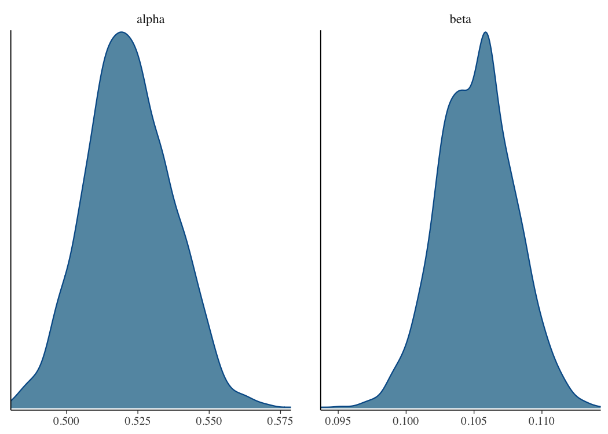

So we can easily do things like find the probability that coeffs lie in
*a**n**y* given interval, or compute statistics based on the parameters.
We also can generate `visits` samples, so can find probabilites for
outcomes, likelihood ratios, etc. For example, we can compare the
likelihood that a person with 10 `hcc_conds` has more than 4 visits, to
that of a person with 5 hcc’s.

$$
\frac{P({vists} > 4 | {hcc} = 10)}{P({vists} > 4 | {hcc} = 5)}
$$

We simulate 2000 samples of each and compare the proportion of the
samples in each case that are greater than 4.

``` r
set.seed(84732)
pred_new <- samps_df %>% mutate(vis_5cond = rpois(2000, exp(alpha + 5*beta))) %>%
         mutate(vis_10cond = rpois(2000, exp(alpha + 10*beta))) %>% select(c(vis_10cond, vis_5cond))

mean(pred_new$vis_10cond > 4)/mean(pred_new$vis_5cond > 4)
```

    [1] 3.270517

So a person with 10 hcc is over three times as likely to have more than
4 visits than a person with only 5 hcc.

As posterior check, we can look at the distribution of visits, as we did
with previous last models.

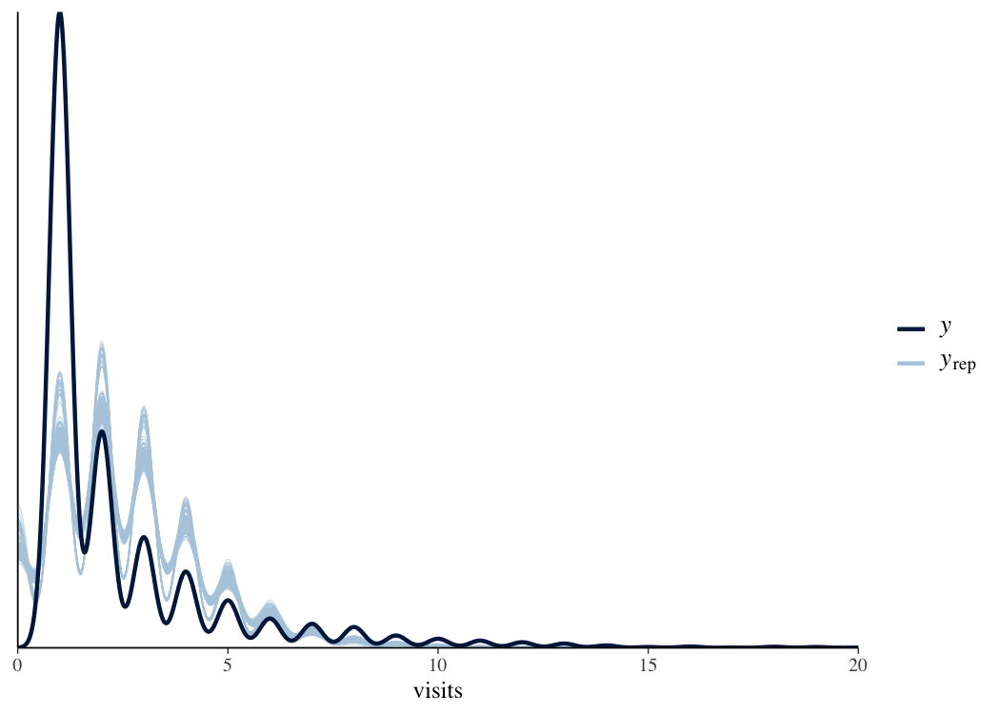
Okay so not so great. We can see the problem with the zero values. The
model also underestimates one values and overestimates larger values -
the same dispersion issue we saw before. If the actual data contains no
zero values, a truncated version of either a Poisson or a negative
binomial model might work here. We will briefly try a negative binomial
but will not address this issue fully here, continuing so as to
illustrate process rather than validity of results. Also note that we
have included only a single predictor in the model, and one with a weak
correlation with the outcome.

We try the negative binomial model

$$
\begin{align*}
visits_i & \sim {NB}(\mu_{i}, \phi) \\
\log \mu_{i} & = \alpha +\beta \times hcc \ count_i \\
\end{align*}
$$

We find the summary results for the coefficients consistent with those
for the Poisson model, and similar distributions, though now we have the
additional *ϕ* parameter.

    # A tibble: 4 × 3
      term    estimate std.error
      <chr>      <dbl>     <dbl>
    1 alpha      0.516   0.0225 
    2 beta       0.107   0.00449
    3 inv_phi    0.335   0.0136 
    4 phi        2.99    0.122  

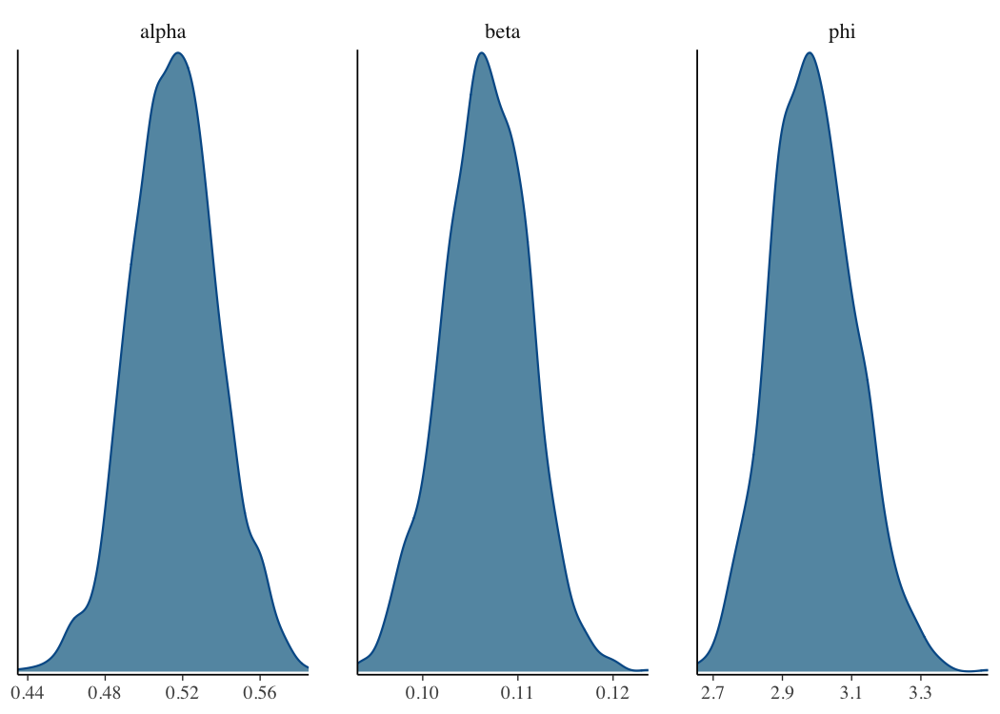

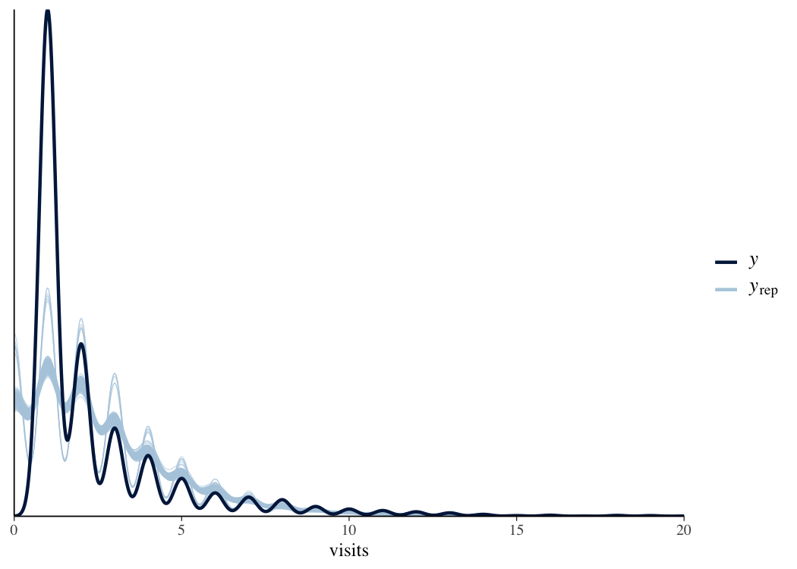

This model does a little better reproducing the data observations for
visits greater than 1, but still not very good for zero and 1. Again, a
truncated model may be necessary, or not, depending on the data. We
would expect that Ibis users may have zero visits, and ideally would
want the possibility of zero visits for comparison populations. For our
data here each row indicates a hospital visit so that is not the case.

## More fake data

To illustrate how we might model Ibis use, we add a fake indicator
variable to our data to represent use of the device or not. Use or not
will be assigned randomly, but we will stack the deck in our favor by
making the use more likely for those with less than 5 hcc count, with
probabilities of 65% and 45% respectively.

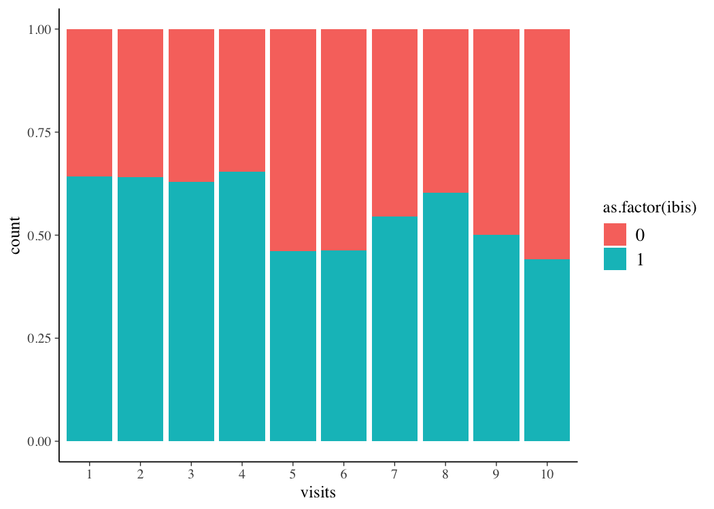

We can see the slight interaction between `ibis` and `hcc_conds` as
evidenced by the different slopes for the linear regression lines in
each case

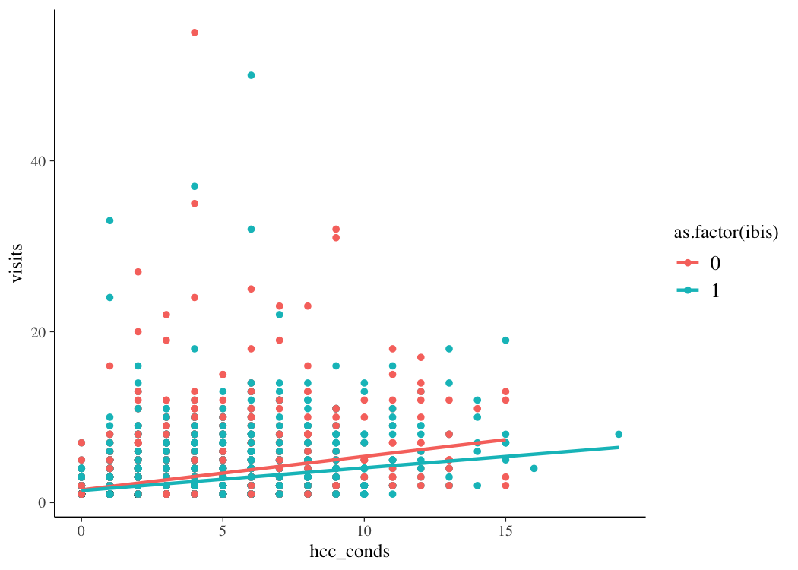
We can also check the overall mean of `visits` with `ibis` vs not.

    # A tibble: 2 × 2
       ibis ave_visits
      <dbl>      <dbl>
    1     0       2.90
    2     1       2.35

It turns out the difference is statistically significant in the NHST
sense.


        One-way analysis of means (not assuming equal variances)

    data:  ibis_fake$visits and ibis_fake$ibis
    F = 30.42, num df = 1.0, denom df = 2948.7, p-value = 3.781e-08

We will again try the Poisson model, which is now

$$
\begin{align*}
visits_i & \sim {Poisson}(\mu_i) \\
\log \mu_{i} & = \alpha +\beta_{hcc} \times hcc \ count_i + \beta_{ibis} \times ibis_i 
\end{align*}
$$

where ibis<sub>*i*</sub> is a 0/1 indicator variable. The model thus has
the effect of adjusting the intercept *α* for Ibis users. As mentioned
previously, there are several ways to model this. One can also for
example model the slopes *β*<sub>*h**c**c*</sub> separately for ibis vs
non ibis. This is one way to address the interaction between `ibis` and
`hcc_conds` seen in the above scatterplot.

As before, we can check the non-Bayes Poisson regression model

    # A tibble: 3 × 5
      term        estimate std.error statistic   p.value
      <chr>          <dbl>     <dbl>     <dbl>     <dbl>
    1 (Intercept)    1.90    0.0193       33.2 3.20e-242
    2 ibis           0.816   0.0187      -10.8 2.11e- 27
    3 hcc_conds      1.11    0.00293      35.9 9.39e-282

And now the Bayesian model

    # A tibble: 3 × 3
      term        estimate std.error
      <chr>          <dbl>     <dbl>
    1 (Intercept)    0.642   0.0194 
    2 ibis          -0.204   0.0179 
    3 hcc_conds      0.105   0.00294

``` r
exp(0.646)
```

    [1] 1.907894

``` r
exp(-0.199)
```

    [1] 0.8195499

``` r
exp(0.103)
```

    [1] 1.108491

Again agreeing with the point estimates above.

## Stratification and contrasts

As an example of examining the outcome variable across different strata
of the predictors, we compare posterior predictions for patients using
or not using ibis, with 5 hcc conditions.

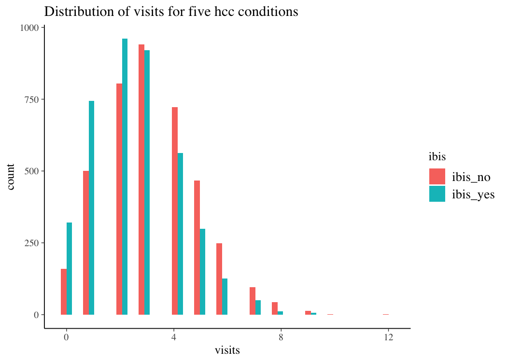

We can see that after three visits the non users dominate. We can
quantify this with the likelihood ratio

$$
\frac{P({vists} > 3 | {hcc} = 5, {ibis} = no)}{P({vists} > 3 | {hcc} = 5, {ibis} = yes)}
$$

and find this is

``` r
mean(pp$ibis_no > 3)/mean(pp$ibis_yes > 3)
```

    [1] 1.509953

So non-users with five hcc are about 50% more likely to have more than
three visits. As a remark, we stress that this statistic is itself a
random variable and our value is but one outcome. So in practice we
would simulate it many times and generate a distribution. Then we could
generate credible intervals and p-value type probabilities for this
likelihood

If we repeat the above with ten hcc conditions we obtain the ratio

    [1] 1.222265

That the likelihood ratio seems to be dependent on the the number of hcc
suggests that there is an interaction between `hcc_count` and `ibis`. We
saw that above in the plot of `visits` vs `hcc_count`, stratified by
`ibis`.

We can compare or contrast the difference in the number of visits, for
`ibis` versus non users. One way to do this is to change the `ibis`
variable in the patient data to indicate use; that is, as if all
existing patients had used Ibis, then use the model to predict visits.
Now do the same with `ibis` changed to indicate non use. We can then get
a distribution for the expected number of visits in each case, and hence
a distribution for the difference in the expected number of visits.

## Things we’ve left out

The above does not address the following

-   Validation. In order to assess model performance one would typically
    use some kind of validation scheme. The simplest is to split the
    data into training and test sets. Cross validation is another
    approach that gives estimates of the variability of error estimates.
    (Though cross validation is sometimes used with Bayesian models, in
    some sense we get this for free as a consequence of the
    modeling/sampling process.) Cross validation is also used in
    standard ML approaches for tuning model “hyperparameters”-
    parameters not estimated directly from the data- which include for
    example the penalty and mixture in a regularized regression, the
    number of trees, or the learning rate in a boosted tree model.
    Generally, one does not use test data to inform the model building
    in any way. In some cases mild forms of “data leakage” may be
    permissible. In the above we do not address validation as our
    purposes were mostly for illustration.
-   Data preprocessing and feature engineering. This includes things
    like removing near zero variance predictors, scaling parameters,
    which is required for some models require, any coding of factor
    variables, and any transformation of parameters.
-   ordering of the HCC
-   Hierarchical models. These take advantage of group structure (all
    women, all Ibis users, etc) and model each separately, with partial
    pooling for the entire population. For example, with group indicator
    *j* the model might look like

$$
\begin{align*}
visits_i & \sim {Poisson}(\mu_{i}) \\
\log \mu_{i,j} & = \alpha_j + \beta_{hcc, j} \times hcc \ count_i  + \beta_{ibis, j} \times ibis_i
\end{align*}
$$

-   Dealing with non-existence of zeros in the data.
-   More predictors- comorbidity scores. I have tested an R package
    mapping from ICD 10 codes to Charlson and Elixhauser scores, both of
    which are used by clinicians and have appeared in the health
    informatics literature.
-   More predictors. It is common for OHDSI studies to have more than
    10k predictors, for example. Methods for reducing the predictor set
    were mentioned above. Creating the predictors in the first place
    would be a data engineering problem.
-   Propensity score and inverse probability of treatment weighting
    methods for comparison populations. Such techniques match patients
    with similar profiles to control confounding and thus mimic
    randomized controlled studies.
-   Other diagnostic/condition categorise- DRG, ACG, CRG, etc.
-   Likelihood encodings for ICD 10 or for condion categories
-   Truncated distributions. To handle non zero data.
-   That hospital or ER data will not have zero values is itself a
    problem as it is selection bias.
-   Interaction terms.
-   Other model approaches- tree-based, neural nets, etc.
